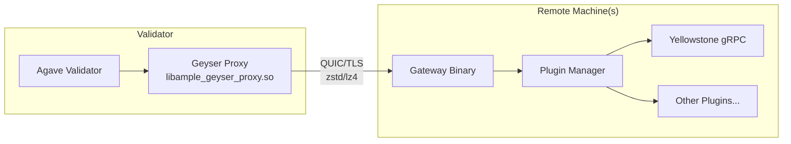

# Ample Geyser Proxy

Stream Solana validator events over QUIC/TLS to run Geyser plugins remotely — keeping your validator lean.



## Why?

- **Validator isolation** — Plugin crashes and resource usage don't affect your validator
- **Multi-tenant** — Serve multiple clients with different plugins/versions from one gateway
- **Mainnet plugin dev** — Iterate on geyser plugins against live data without running a full validator
- **Performance** — While other projects similar to this one exist, the sole focus of ample_geyser_gateway is ultimately performance & latency. Preliminary tests measure sub-millisecond latency across all types of replica notifications.

## Quick Start

### 1. Generate TLS Certs

```sh
cargo run -p cert_gen -- --fqdn your.server.fqdn --cert certs/cert.pem --key certs/key.pem
```

### 2. Build

```sh
cargo build -p geyser_proxy --release           # Server plugin
cargo build -p ample_geyser_gateway --release   # Client binary
```

### 3. Configure & Run Proxy (Validator)

Create `ample_geyser_config.json`:

```json
{
  "libpath": "target/release/libample_geyser_proxy.so",
  "transport_opts": { "cert_path": "./certs/cert.pem", "key_path": "./certs/key.pem", "fqdn": "your.server.fqdn" },
  "transport_cfg": { "use_zstd_compression": true },
  "bind_addr": "0.0.0.0:25565"
}
```

```sh
agave-validator --geyser-plugin-path /path/to/ample_geyser_config.json
```

### 4. Run Gateway (Client)

```sh
ample_geyser_gateway \
  --upstream-proxy-addr 127.0.0.1:25565 \
  --fqdn your.server.fqdn \
  --geyser-plugin-config /path/to/yellowstone_config.json
```


## Features

| Feature | Description |
|---------|-------------|
| QUIC Transport | Separate streams per event type (accounts, txs, blocks, entries, slots) |
| Compression | zstd (~100-150 Mbit) or lz4 (~150-200 Mbit, lower latency) |
| Account Coalescing | Merge rapid updates for same pubkey |
| OTLP Metrics | `--metrics-otlp-url` for observability |

## Compatibility
v3.0.7-v3.0.11

## License

MIT
