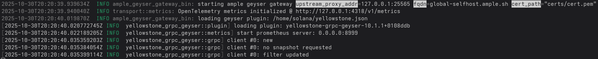

# Ample Geyser Proxy + Gateway

The validator hosts a tiny proxy that streams events over QUIC/TLS, and your gateway picks them up and runs the plugins locally.
For operators: keeps your validator & RPC nodes lean. For devs: iterate geyser plugins on mainnet without the validator hassle.

### TL;DR It's a geyser plugin that runs a QUIC server where the gateway can connect to - and run geyser plugins itself based on that data source

## What's in the Box

This repo has two main pieces:

- **Geyser Proxy** (server side, runs as a Solana Geyser plugin)
    - Crate: `crates/geyser_proxy` → spits out `libample_geyser_proxy.so`
    - Lives in the validator, spins up a QUIC server, streams the events
    - Has options for compression (zstd or lz4) and account coalescing to cut down on chatter

- **Gateway** (client side, standalone binary)
    - Crate: `crates/gateway_bin` → `ample_geyser_gateway` binary
    - Connects to the proxy, pulls in live streams (accounts, txs, entries, blocks, slot status)
    - Loads and runs one or more Geyser plugins locally via Agave's plugin manager
    - Can push metrics to OTLP if you want

The transport bits are in `crates/transport`, shared between both.

## Features & Relevant Info

- QUIC transport layer
- ALPN set to `ample/0.1`
- Separate streams per event type to avoid head-of-line blocking
- Compression: zstd for bandwidth savings, lz4 for snappier latency
- Account coalescer on the proxy: merges quick updates for the same pubkey in a tiny window
- Optional OTLP metrics export from the gateway

Current Limitations:
- No snapshot streaming yet (we skip startup account dumps)
- Ordering is per-stream only; no global timeline across everything. This could potentially cause desyncs on bad networks.

## Prerequisites

- TLS certs in PEM format
    - Self Signed: Use our cert gen tool below.
    - External (certbot, etc.): Just point the config at them

## Certs

### Self-Signed

Fire up the helper:

```fish
# From the repo root
cargo run -p cert_gen -- --fqdn localhost --cert certs/cert.pem --key certs/key.pem
```

Swap `localhost` for your server's real FQDN; it has to match what the client uses for `--fqdn`. Gets you PEM files, ready to go.

### External Certs

If you've got Let's Encrypt or other external service, copy the relative PEM cert/key files somewhere and reference them in the proxy config.

## Building

### Proxy Plugin (Server)

```fish
cargo build -p geyser_proxy --release
```

Gives you the geyser plugin shared library `target/release/libample_geyser_proxy.so`.

### Gateway Binary (Client)

```fish
cargo build -p ample_geyser_gateway --release
```

Or just `cargo run -p ample_geyser_gateway` for testing. Produces `target/release/ample_geyser_gateway`.

## Config the Proxy (on Your Validator)

Grab `ample_geyser_config.json`, tweak it for your setup. Key parts:

```json
{
  "libpath": "target/release/libample_geyser_proxy.so",
  "log_level": "info",

  "transport_opts": {
    "cert_path": "./certs/cert.pem",
    "key_path": "./certs/key.pem",
    "fqdn": "your.proxy.fqdn"
  },

  "transport_cfg": {
    "use_lz4_compression": false,
    "use_zstd_compression": true
  },

  "bind_addr": "0.0.0.0:25565",

  "use_account_coalescer": false,
  "account_coalescer_duration_us": 1000
}
```

Quick notes:
- `transport_opts.cert_path/key_path`: PEM files the server uses
- `transport_opts.fqdn`: hostname clients check and send during handshake
- `transport_cfg`: zstd saves bandwidth, lz4 shaves a bit off latency
- `bind_addr`: where the proxy listens for gateways
- `use_account_coalescer`: merges rapid updates for the same pubkey in the window if true
- `account_coalescer_duration_us`: coalescing window; balance bandwidth vs. lag


## Install the Proxy in the Validator

Use Agave's plugin loading:

```fish
# At startup
agave-validator --geyser-plugin-path /absolute/path/to/ample_geyser_config.json

# Or load it later
agave-validator plugin load /absolute/path/to/ample_geyser_config.json
```

It'll start a QUIC server on `bind_addr` and start pumping events.

## Run the Gateway (Client) and Load Plugins

Basic launch:

```fish
RUST_LOG info cargo run -p ample_geyser_gateway -- \
  --upstream-proxy-addr 127.0.0.1:25565 \
  --fqdn your.proxy.fqdn \
  --geyser-plugin-config /path/to/your_plugin_config.json
```

Tips:
- `--upstream-proxy-addr`: IP:port of your validator's proxy
- Stack `--geyser-plugin-config` for multiple plugins (short: `-g`)
- `--cert-path` defaults to `certs/cert.pem` - override if your trust root is elsewhere
- Client pins to the PEM you give it;verifies server cert and FQDN

Example with Yellowstone gRPC plugin:

```fish
RUST_LOG info cargo run -p ample_geyser_gateway -- \
  --upstream-proxy-addr 127.0.0.1:25565 \
  --fqdn your.proxy.fqdn \
  --geyser-plugin-config /etc/yellowstone/grpc-config.json
```



## Metrics

Gateway can export OTLP metrics over HTTP. Pass `--metrics-otlp-url`.

```fish
set -x RUST_LOG debug
# Recommended to collect on an interval less than or 5 seconds
# set -x OTEL_METRIC_EXPORT_INTERVAL 5000
cargo run -p ample_geyser_gateway -- \
  --upstream-proxy-addr 127.0.0.1:25565 \
  --fqdn your.proxy.fqdn \
  --metrics-otlp-url http://global-geyser-proxy.otlp.ample.sh:4318/v1/metrics \
  --geyser-plugin-config /path/to/plugin.json
```
Replace with your own otlp endpoint if needed.


## Troubleshooting

- TLS handshake failing?
    - Double-check `--fqdn` matches cert's CN/SAN
    - Make sure client's `--cert-path` points to server's PEM
- Connects but no data?
    - Is `bind_addr` reachable? Firewall?
    - Logs might show `InvalidStreamOp` if compression's off, but it should negotiate
- "MissingKeyPath" server-side?
    - Proxy needs both `cert_path` and `key_path` in `transport_opts`
- Bandwidth through the roof?
    - Check compression configuration & observe metrics

## Compatibility

Solana versions v3.0.7+ are supported, older versions probably will not work at the moment. (PRs are welcome for this)

### Bandwidth Usage

With `zstd_compression` enabled, Ample Geyser Proxy uses approximately 100-150 Mbit of constant bandwidth. Most modern Solana validator servers have 10Gbit+ uplinks, making this usage relatively low cost. Further bandwidth optimization is on the roadmap.

Alternatively, `lz4_compression` uses ~150-200 Mbit with only marginally improved latency.

### Technical Foundation

The proxy builds on several key technologies (implementation details in `Cargo.toml`):

- **Agave Geyser Interfaces**: Locked to commit `53d6dd4f...`
- **Bincode**: For efficient message serialization
- **QUIC + rustls**: For transport and TLS security

## What's Next (Roadmap)

- Account snapshot bootstrap (gateway pulls initial state, then goes live)
- Sharding streams by pubkey/tx for even less HOL blocking
- Smarter batching with backpressure

If you have an idea / use case, hit up an issue and tell us!

---
